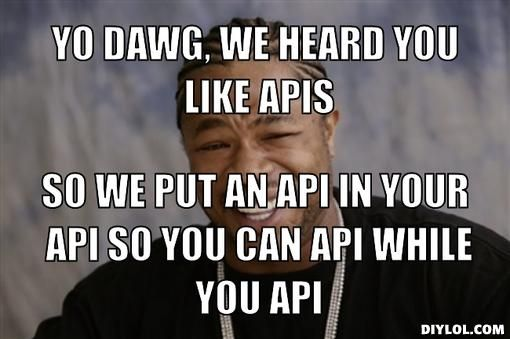

# ajax-pokedex

---

## MaTS (Meme about This Subject)


---
## About

In this project I am going to implement an API to create a pokedex.  
What is a pokedex you ask?
* This is a list created and designed to catalog and provide information regarding the various species of Pokémon

---

## Learning Objectives
- [] A typical AJAX flow: send asynchronous requests to a remote server and process the results;
- [] **[JSON](https://www.w3schools.com/js/js_json_intro.asp)** (JavaScript Object Notation) format;
- [] DOM manipulation: changing the DOM based on results of AJAX-requests.
---
## Exercise 
Make a [Pokédex](https://www.google.com/search?q=pokedex&source=lnms&tbm=isch&sa=X&ved=0ahUKEwiRtNT3-vDfAhWDy6QKHd1cBD4Q_AUIDigB&biw=1300&bih=968#imgrc=_) using [this API](https://pokeapi.co/).

---
## Goals

- [] search a pokémon by name and by ID
- [] Of said pokémon you need to show:
  - [] The ID-number
  - [] An image (sprite)
  - [] _At least_ 4 "moves"
  - [] The previous evolution, _only if it exists_, along with their name and image. Be carefull, you cannot just do ID-1 to get the previous form, for example look into "magmar" - "magmortar". You have to use a seperate api call for this!

- [] Make your web page look like a pokédex by adding a little CSS.

---
## Extra challenge
There are a couple of pokemon that don't play with the normal rules, add code so their cases are also handled elegantly.

- Ditto only has 1 move.
- Eevee has 6 evolutions.

---
### Nice to haves
- [] Have a next / previous button
---

### To-Do (fix)
- [] Styling
- [] Eevee's 
---
# Research
### What is an API?
### AJAX flow
### JSON
### DOM manipulation

---
## What is an API?
````
API stands for application programming interface.
The most important part of this name is “interface,”because an API essentially talks to a program for you. 
You still need to know the language to communicate with the program, but without an API, you won’t get far.
````
### TL;DR
An API allows one program to request data from another.
#### Links: 
* https://technologyadvice.com/blog/information-technology/how-to-use-an-api/
* https://www.mulesoft.com/resources/api/what-is-an-api
---
## What is an AJAX flow?
````
AJAX is a technique for creating fast and dynamic web pages.
AJAX allows web pages to be updated asynchronously by exchanging small amounts of data with the server behind the scenes.
This means that it is possible to update parts of a web page, without reloading the whole page.
````
### Examples
Twitter has recently used AJAX for their updates. Every time new tweets have been made about certain trending subjects, Twitter will update the new figures without affecting the main page.

#### Links:
* https://www.w3schools.com/php/php_ajax_intro.asp#:~:text=AJAX%20is%20a%20technique%20for,without%20reloading%20the%20whole%20page.
* https://www.hostinger.com/tutorials/what-is-ajax
### AJAX vs fetch
* AJAX uses callbacks
* fetch uses promises
---
## What is JSON?
````
JavaScript Object Notation (JSON) is a standard text-based format for representing structured data based on JavaScript object syntax. 
It is commonly used for transmitting data in web applications 
(e.g., sending some data from the server to the client, so it can be displayed on a web page, or vice versa).
````
#### Links:
* https://developer.mozilla.org/en-US/docs/Learn/JavaScript/Objects/JSON
* https://www.w3schools.com/whatis/whatis_json.asp
* https://www.w3schools.com/js/js_json_intro.asp
---
## What is DOM manipulation?
````
DOM manipulation is interacting with the DOM API to change/modify the HTML document that is to be rendered on the web browser. 
An HTML document can be changed/modified to add elements, remove elements, edit elements, move elements around, etc.
````
By manipulating the DOM you can create applications that will update the data of the page without a refresh, change the layout of a page without a refresh.   
You can shuffle, move or delete elements across the document.

#### Links:
* https://medium.com/swlh/what-is-dom-manipulation-dd1f701723e3#:~:text=DOM%20manipulation%20is%20interacting%20with,%2C%20move%20elements%20around%2C%20etc.
* https://developer.mozilla.org/en-US/docs/Learn/JavaScript/Client-side_web_APIs/Manipulating_documents

---
## Reflection time
(When project is done)

---
## Useful resources 
* ${}: https://discuss.codecademy.com/t/what-does-this-syntax-do/432913